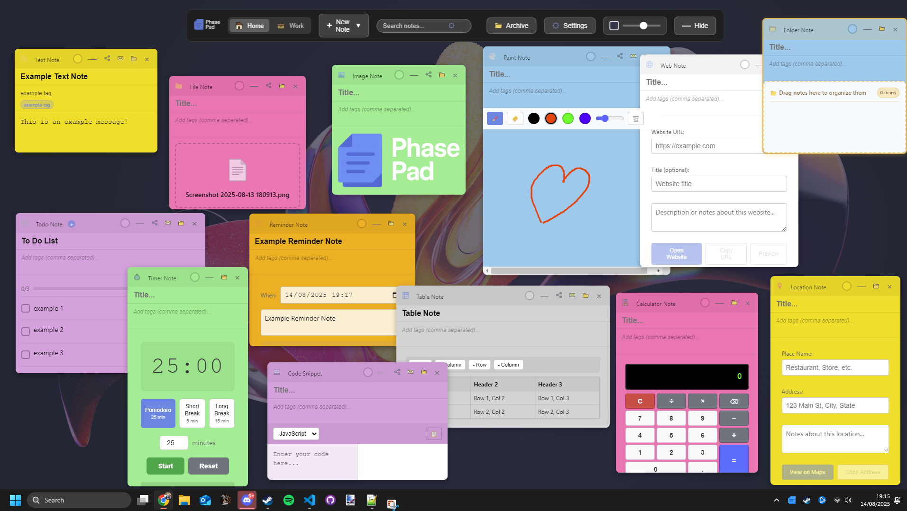

# PhasePad

A powerful, transparent overlay sticky notes application for Windows that lets you place notes, images, timers, and various widgets directly on your desktop. Perfect for quick notes, reminders, and staying organized while you work.


## Features

### Core Functionality
- **Global Hotkeys**: Customizable keyboard shortcuts (Default: Alt+Q to toggle)
- **Transparent Overlay**: Semi-transparent background that doesn't interfere with your workflow
- **Dual Workspaces**: Switch between "Home" and "Work" workspaces to organize different contexts
- **Persistent Storage**: All notes and settings are automatically saved and restored

### Screenshots



### Note Types
Create various types of notes to suit your needs:

- **Text Notes**: Standard sticky notes with rich text support
- **File Notes**: Link to files and folders on your system
- **Image Notes**: Display images and screenshots
- **Paint Notes**: Draw and sketch with built-in drawing tools
- **Todo Notes**: Create checklists and track tasks
- **Reminder Notes**: Set timed reminders with notifications
- **Web Notes**: Save websites and URLs
- **Table Notes**: Create data tables and organized lists
- **Location Notes**: Save addresses and location information
- **Calculator Notes**: Built-in calculator functionality
- **Timer Notes**: Pomodoro timers and countdown timers
- **Folder Notes**: Organize related notes into groups
- **Code Snippets**: Syntax-highlighted code blocks

### Advanced Features
- **Search Functionality**: Find notes by title, content, or tags with advanced search options
- **Archive System**: Archive old notes to keep workspace clean
- **Note Management**: 
  - Drag notes to reposition
  - Resize notes by dragging corners
  - 8 color themes for organization
  - Add tags for better categorization
- **Data Management**:
  - Configurable data folder location (perfect for cloud sync)
  - Import/export functionality (JSON and Markdown)
  - Reset all data option
- **Customization**:
  - Configurable hotkeys for all major functions
  - Adjustable overlay opacity and color
  - Multiple overlay themes

### Screenshot & Image Tools
- **Area Screenshot**: Select any area of your screen to capture
- **Full Screen Screenshot**: Capture entire desktop
- **Image Annotations**: Draw on images with various tools
- **Context Menu Integration**: Right-click on images to add to PhasePad

## Default Hotkeys

- **Alt+Q**: Toggle overlay visibility
- **Ctrl+Shift+N**: Create new note
- **Ctrl+F**: Focus search
- **Ctrl+Shift+A**: Toggle archive view

*All hotkeys can be customized in Settings → Configure Hotkeys*

## Usage

### Getting Started
1. Launch PhasePad with `npm start`
2. Press **Alt+Q** to show/hide the overlay
3. Click the "New Note" dropdown to choose your note type
4. Switch between Home and Work workspaces as needed

### Managing Notes
- **Create**: Click "New Note" and select the type
- **Edit**: Click on any note to start editing
- **Move**: Drag the note header to reposition
- **Resize**: Drag the corners or edges to resize
- **Color**: Click the color indicator to change themes
- **Delete**: Click the X button to remove
- **Archive**: Use the archive button to hide old notes

### Settings & Configuration
Access settings via the gear icon in the toolbar:
- **Configure Hotkeys**: Set custom keyboard shortcuts
- **Change Data Folder**: Choose where your data is stored (great for cloud sync)
- **Import/Export**: Backup and restore your notes
- **Reset Data**: Clear all notes and start fresh

## Development

### Built With
- **Electron**: Cross-platform desktop framework
- **HTML/CSS/JavaScript**: Frontend interface
- **Node.js**: Backend functionality
- **@electron/remote**: Inter-process communication

### Project Structure
```
PhasePad/
├── main.js                    # Electron main process
├── overlay/
│   ├── overlay.html          # Main overlay interface
│   ├── overlay.css           # All styling
│   ├── overlay.js            # Core application logic
│   ├── area-select.html      # Screenshot area selector
│   └── timer-window.html     # Detached timer windows
├── media/                    # Logo and icon files
│   ├── LogoWhite.png         # White logo for overlay
│   ├── LogoBlack.png         # Black logo variant
│   └── PhasePad.ico          # Application icon
├── data/                     # User data storage
│   ├── home-notes.json       # Home workspace notes
│   ├── work-notes.json       # Work workspace notes
│   └── workspace-preference.json
├── config.json              # User configuration
├── package.json             # Project dependencies
└── README.md
```

### Key Components
- **Workspace System**: Dual workspace support for organizing contexts
- **Note Rendering Engine**: Dynamic note type handling and rendering
- **Search System**: Full-text search with filtering options
- **Timer System**: Background timers with notifications
- **Configuration Manager**: Settings persistence and hotkey management

## License

This project is licensed under the MIT License - see the [LICENSE](LICENSE) file for details.

**In simple terms:**
- Free to use for any purpose (personal, commercial, etc.)
- Free to modify and distribute
- Must include the original copyright notice
- No warranty provided

## Contributing

Contributions are welcome! Please feel free to submit a Pull Request.

## Security

PhasePad is signed with a self-signed certificate. When installing:
- Publisher will show as "OwenModsTW"
- Windows may still show a security warning (normal for self-signed certificates)
- Click "More info" → "Run anyway" to install
- This is safe - PhasePad is open source and auditable

## Support

If you encounter any issues or have feature requests, please create an issue in the GitHub repository.

## Future Roadmap

- Cross-platform support (macOS, Linux)
- Cloud synchronization built-in
- Plugin system for custom note types
- Team collaboration features
- Mobile companion app
- Advanced text formatting
- Voice notes
- OCR for image text extraction
